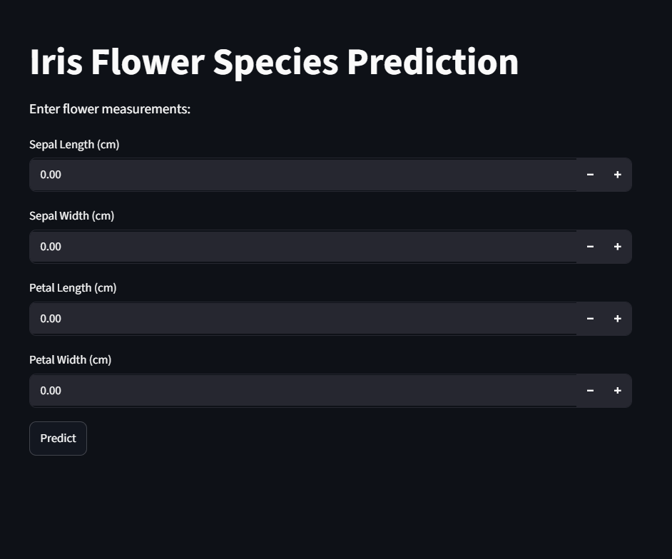
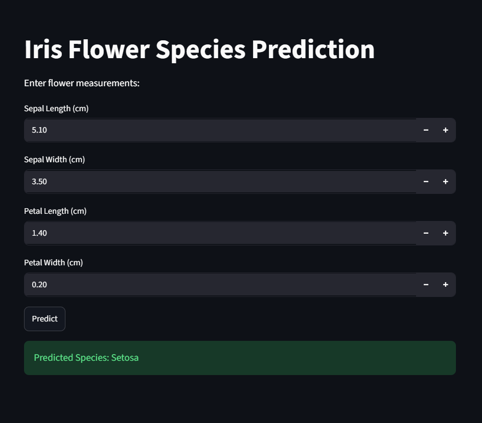

# 🌸 Iris Flower Prediction using Machine Learning

## 📌 Project Overview

This project predicts the species of an Iris flower using Machine Learning algorithms. Users can enter flower measurements through a Streamlit web application, and the trained model instantly predicts the flower species.

---

## 🎯 Objective

The objective of this project is to classify Iris flowers into one of three species:

- Iris Setosa
- Iris Versicolor
- Iris Virginica

---

## 🛠️ Technologies Used

- Python
- Streamlit
- Scikit-Learn
- Pandas
- NumPy
- Pickle

---

## 📊 Dataset Information

The project uses the famous Iris Dataset containing the following features:

- Sepal Length
- Sepal Width
- Petal Length
- Petal Width

Target Classes:

- Setosa
- Versicolor
- Virginica

---

## 🤖 Machine Learning Model

**Model Used:** Logistic Regression

The model was trained and evaluated using the Iris Dataset and achieved excellent performance on the test dataset.

### Model Performance

| Metric | Score |
|----------|----------|
| Accuracy | 100% |
| Precision | 100% |
| Recall | 100% |
| F1-Score | 100% |

---

## ✨ Features

- Real-time Iris flower prediction
- Simple and interactive user interface
- Accurate Machine Learning model
- Fast prediction results
- Easy deployment using Streamlit

---

## 📂 Project Structure

iris-flower-prediction
│
├── app.py
├── iris_model.pkl
├── requirements.txt
└── README.md

---

## 📸 Application Screenshot

### Home Page

### Prediction Result

---

## 🚀 Future Enhancements

- Improved user interface
- Confidence score display
- Cloud deployment
- Additional flower datasets support

---

## 👩‍💻 Author

**Shreya Prajapati**

B.Sc.(IT)
